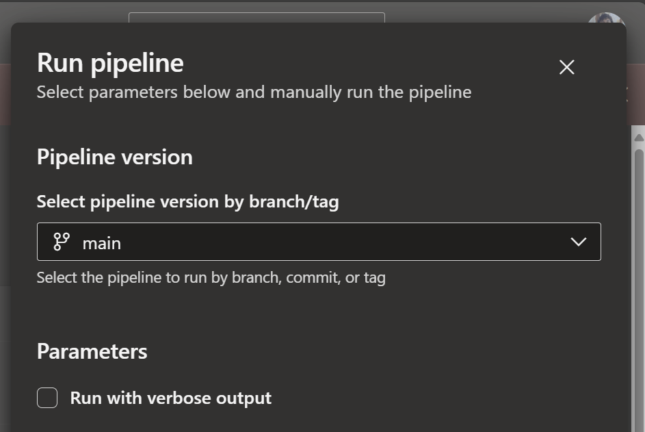

# Pipelines

Pipelines define complete automation workflows consisting of jobs that run nodes. See the [IntoPipeline trait documentation](https://openvmm.dev/rustdoc/linux/flowey_core/pipeline/trait.IntoPipeline.html) for detailed examples.

## Pipeline Jobs

[`PipelineJob`](https://openvmm.dev/rustdoc/linux/flowey_core/pipeline/struct.PipelineJob.html) instances are configured using a builder pattern:

```rust
let job = pipeline
    .new_job(platform, arch, "my-job")
    .with_timeout_in_minutes(60)
    .with_condition(some_param)
    .ado_set_pool("my-pool")
    .gh_set_pool(GhRunner::UbuntuLatest)
    .dep_on(|ctx| {
        // Define what nodes this job depends on
        some_node::Request { /* ... */ }
    })
    .finish();
```

### Pipeline Parameters

Parameters allow runtime configuration of pipelines. In Azure DevOps, parameters appear as editable fields in the Run pipeline UI (name, description, default).



```rust
// Define a boolean parameter
let verbose = pipeline.new_parameter_bool(
    "verbose",
    "Run with verbose output",
    ParameterKind::Stable,
    Some(false) // default value
);

// Use the parameter in a job
let job = pipeline.new_job(...)
    .dep_on(|ctx| {
        let verbose = ctx.use_parameter(verbose);
        // verbose is now a ReadVar<bool>
    })
    .finish();
```

#### Stable vs Unstable Parameters

Every parameter in flowey must be declared as either **Stable** or **Unstable** using [`ParameterKind`](https://openvmm.dev/rustdoc/linux/flowey_core/pipeline/enum.ParameterKind.html). This classification determines the parameter's visibility and API stability:

**Stable Parameters ([`ParameterKind::Stable`](https://openvmm.dev/rustdoc/linux/flowey_core/pipeline/enum.ParameterKind.html#variant.Stable))**

Stable parameters represent a **public, stable API** for the pipeline:

- **External Visibility**: The parameter name is exposed as-is in the generated CI YAML, making it callable by external pipelines and users.
- **API Contract**: Once a parameter is marked stable, its name and behavior should be maintained for backward compatibility. Removing or renaming a stable parameter is a breaking change.
- **Use Cases**:
  - Parameters that control major pipeline behavior (e.g., `enable_tests`, `build_configuration`)
  - Parameters intended for use by other teams or external automation
  - Parameters documented as part of the pipeline's public interface

**Unstable Parameters ([`ParameterKind::Unstable`](https://openvmm.dev/rustdoc/linux/flowey_core/pipeline/enum.ParameterKind.html#variant.Unstable))**

Unstable parameters are for **internal use** and experimentation:

- **Internal Only**: The parameter name is prefixed with `__unstable_` in the generated YAML (e.g., `__unstable_debug_mode`), signaling that it's not part of the stable API.
- **No Stability Guarantee**: Unstable parameters can be renamed, removed, or have their behavior changed without notice. External consumers should not depend on them.
- **Use Cases**:
  - Experimental features or debugging flags
  - Internal pipeline configuration that may change frequently
  - Parameters for development/testing that shouldn't be used in production
